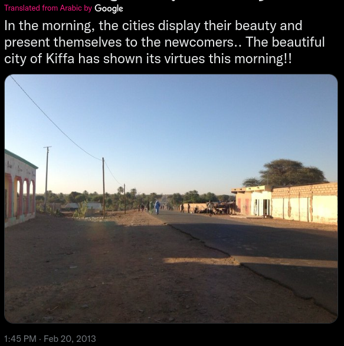

This is the first Geolocation Exercise (OSINT Exercise #001) by Sofia Santos (gralhix.com). I will be writing through my process. 

A cursory look at the given image, a screenshot from Twitter, has some immediately relevant information. First, it is translated from Arabic, so we can start from the base that it is an Arabic-speaking location, and references the city of Kiffa. Kiffa, on a quick search, is a town in the southern part of Mauritania.

Next, the photo itself. There are a few features that stand out: two sets of structures on either side of a paved road; power lines on one side of the road; a large tree behind one of the buildings, with many more trees closer at the horizon. 

After the features themselves, the shadows catch my eye. The message indicates that this photo was taken in the morning, and for the moment I will take that at face value. That means we can look to the direction of the shadows to give us a lead as to the orientation of the rest of the features in the photo. The shadows are cast from the left side of the photo to the right, so we are looking somewhat southward.

So we have a paved road that is running roughly north-south, with a slight bend, and power lines that follow along its east side. There is a large tree to the southwest, and many trees to the south. The trees are especially notable, as Kiffa is situated in the arid Aoukar basin region. We are near a significant water source.

A look at satellite imagery and, indeed, there is a river that runs through Kiffa. 

The fact that the road is paved narrows things down, as well, as there are only a few paved streets in Kiffa at all, and even fewer that go roughly southwest facing the river.

Using the time slider in Google Earth, I’ve adjusted the satellite imagery to 2013, per the original Tweet, to make sure that building and tree locations align temporally with the photo.

Looking through the larger paved roads yields one main option that meets the above criteria.

Lining up some of the features of the image (building on the left; two buildings on the right; trees behind the buildings on the right), I’m able to place the coordinates of the photographer at approximately 16°36'34.37"N, 11°23'52.27"W.

